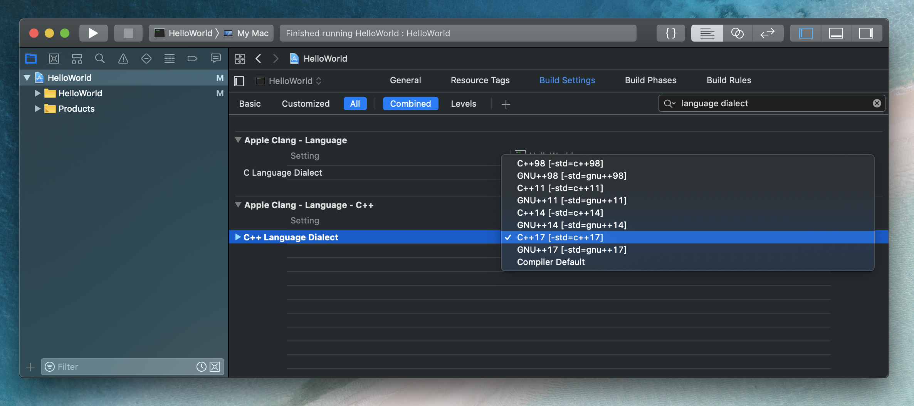

# Getting Started

## Simple Hello World

```cpp
#include <iostream>

int main()
{
    std::cout << "Hello, world!\n";
}
```

### Using Namespace

```cpp
#include <iostream>

using namespace std;

int main()
{
    cout << "Hello, world!\n";
}
```

### Using `endl`

_Using `std::endl` results in a performance hit because it not only returns a new line but flushes the output buffer._

```cpp
#include <iostream>

int main()
{
    std::cout << "Hello, world!" << std::endl;
}
```

## Compile and Run with C++ 17 (2018)

### Bash

```bash
$ g++ -std=c++17 HelloWorld/main.cpp -o out && ./out
```

### Xcode

**Build Settings** > **Apple LLVM 9.0 - Language - C++** > **C++ Language Dialect** > Select **C++17 [-std=c++17]**


